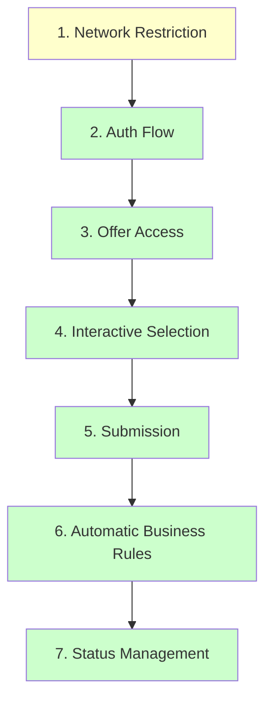

# 🔍 Audit: Parcours Employé Cible (Target Employee Journey)

**Date d'audit:** 2026-03-20  
**Auditeur:** Code Mode  
**Statut:** ✅ TOUTES LES FONCTIONNALITÉS IMPLEMENTÉES

---

## 📋 Workflow des 7 Étapes Audité



*Légende: Vert = Fonctionnel, Jaune = Désactivé intentionnellement (demo)*

---

## 🟡 Étape 1: Network Restriction - **DÉSACTIVÉ (Demo)**

### Comportement Attendu
Le système doit restreindre l'accès au réseau interne de l'entreprise (Fenie Brossette Maroc) via middleware ou configuration serveur.

### Implémentation Actuelle
- **UI:** [`app/page.tsx:45-57`](app/page.tsx:45) affiche un badge visuel "Accès Réservé - Réseau Interne"
- **Middleware [`middleware.ts:43-51`](middleware.ts:43):** Code de restriction IP **existe mais commenté** pour permettre l'accès externe en démonstration
- **Note:** Le code est prêt pour la production - il suffit de décommenter les lignes 44-50

### Code Prêt (à décommenter pour production)
```typescript
// middleware.ts lines 44-50
if (!isInternalNetwork(clientIp)) {
  console.log('[Network] Blocked external access from:', clientIp);
  return new NextResponse(
    JSON.stringify({ error: 'Accès restreint au réseau interne' }),
    { status: 403, headers: { 'Content-Type': 'application/json' } }
  );
}
```

### Fichiers Concernés
- [`app/page.tsx`](app/page.tsx:45)
- [`middleware.ts`](middleware.ts:1)

---

## 🟢 Étape 2: Auth Flow - **FONCTIONNEL**

### Comportement Attendu
Home page → Login page → Authentification réussie → Redirection par rôle

### Implémentation Actuelle
| Composant | Statut | Fichier |
|-----------|--------|---------|
| Home avec lien Login | ✅ | [`app/page.tsx:72-81`](app/page.tsx:72) |
| Page Login UI | ✅ | [`app/login/page.tsx`](app/login/page.tsx:1) |
| API Login | ✅ | [`app/api/auth/login/route.ts`](app/api/auth/login/route.ts:1) |
| Session Management | ✅ | [`lib/auth.ts:24-34`](lib/auth.ts:24) |
| Redirection par rôle | ✅ | [`app/login/page.tsx:52-61`](app/login/page.tsx:52) |

### Flux de Redirection
- `owner` → `/owner/dashboard`
- `hr_admin` → `/admin/dashboard`
- `employee` → `/employee/dashboard`

---

## 🟢 Étape 3: Offer Access - **FONCTIONNEL**

### Comportement Attendu
Employé connecté peut accéder à la vue détaillée d'une offre de vacances avec tous les détails.

### Implémentation Actuelle
| Fonctionnalité | Statut | Fichier |
|----------------|--------|---------|
| Liste des offres employé | ✅ | [`app/employee/offers/page.tsx`](app/employee/offers/page.tsx:1) |
| Détail d'une offre | ✅ | [`app/employee/offers/[id]/page.tsx`](app/employee/offers/[id]/page.tsx:1) |
| Protection par auth | ✅ | [`app/employee/offers/page.tsx:41-44`](app/employee/offers/page.tsx:41) |
| Affichage nom hôtel | ✅ | [`app/employee/offers/[id]/page.tsx:205-209`](app/employee/offers/[id]/page.tsx:205) |
| Affichage conditions | ✅ | [`app/employee/offers/[id]/page.tsx:211-216`](app/employee/offers/[id]/page.tsx:211) |

### Navigation
- `/employee/offers` - Liste des offres disponibles (vue tableau)
- `/employee/offers/[id]` - Détail complet avec bouton "Postuler"

### Détails Affichés
- ✅ Titre, Destination, Description
- ✅ Dates, Durée, Prix
- ✅ Places disponibles
- ✅ **Hébergement (hotel_name)** - NOUVEAU
- ✅ **Conditions** - NOUVEAU

---

## 🟢 Étape 4: Interactive Selection - **FONCTIONNEL**

### Comportement Attendu
Un composant calendrier interactif permet de sélectionner les dates pour les demandes de congés.

### Implémentation Actuelle
- **Leave Request:** [`app/employee/leave-request/page.tsx:199-253`](app/employee/leave-request/page.tsx:199) utilise le composant **Calendar avec Popover**
- **Composant Calendrier:** [`components/ui/calendar.tsx`](components/ui/calendar.tsx:1) - **INTÉGRÉ ET FONCTIONNEL**
- **Validation des dates:** Empêche les dates passées, vérifie date fin > date début

### Composants Utilisés
```typescript
// app/employee/leave-request/page.tsx:199-253
<Popover>
  <PopoverTrigger asChild>
    <Button variant="outline">...</Button>
  </PopoverTrigger>
  <PopoverContent className="w-auto p-0">
    <Calendar mode="single" ... />
  </PopoverContent>
</Popover>
```

### Fichiers Concernés
- [`app/employee/leave-request/page.tsx`](app/employee/leave-request/page.tsx:1)
- [`components/ui/calendar.tsx`](components/ui/calendar.tsx:1)

---

## 🟢 Étape 5: Submission - **FONCTIONNEL**

### Comportement Attendu
Un bouton 'Submit' fonctionnel pour envoyer la demande (congés ou offre).

### Implémentation Actuelle
| Type de Demande | Endpoint | Statut |
|-----------------|----------|--------|
| Demande de congés | `POST /api/requests` | ✅ |
| Candidature offre | `POST /api/requests` | ✅ |

### Code Clé
- [`app/api/requests/route.ts:59-148`](app/api/requests/route.ts:59) - Création de demande
- [`lib/db.ts:350-378`](lib/db.ts:350) - `createRequest()` fonction

---

## 🟢 Étape 6: Automatic Business Rules - **FONCTIONNEL**

### Comportement Attendu
Vérification AUTOMATIQUE du 'Solde de congé' et 'Quota' avec création de demande en statut 'auto_rejected' si échec.

### Implémentation Actuelle

#### ✅ Ce qui fonctionne:
| Règle | Vérification | Fichier |
|-------|--------------|---------|
| Solde de congés | Vérifié → auto_rejected si insuffisant | [`app/api/requests/route.ts:77-93`](app/api/requests/route.ts:77) |
| Quota offre (places) | Vérifié → auto_rejected si complet | [`app/api/requests/route.ts:97-111`](app/api/requests/route.ts:97) |
| Double candidature | Vérifié → auto_rejected si doublon | [`app/api/requests/route.ts:114-127`](app/api/requests/route.ts:114) |

#### Code de création auto_rejected [`app/api/requests/route.ts:130-140`](app/api/requests/route.ts:130)
```typescript
const requestId = await createRequest(
  user.id,
  data.type,
  data.offer_id,
  data.start_date,
  data.end_date,
  data.reason,
  requestStatus,  // 'auto_rejected' si règles échouent
  autoRejectionReason || undefined
);
```

### Enum Status Actuel [`lib/db.ts:44`](lib/db.ts:44)
```typescript
status: 'pending' | 'approved' | 'rejected' | 'auto_rejected'
```
✅ **INCLUT 'auto_rejected'**

---

## 🟢 Étape 7: Status Management - **FONCTIONNEL**

### Comportement Attendu
4 états de transition:
1. **'En cours'** - Demande en attente de validation RH
2. **'Acceptée'** - Approuvée par RH
3. **'Refusée'** - Rejetée par RH
4. **'Refus automatique'** - Rejetée automatiquement par le système

### Implémentation Actuelle

#### Mapping Status UI [`app/employee/dashboard/page.tsx:86-97`](app/employee/dashboard/page.tsx:86)
```typescript
const getStatusLabel = (status: string) => {
  switch (status) {
    case 'approved': return 'Acceptée';
    case 'rejected': return 'Refusée';
    case 'auto_rejected': return 'Refus automatique';
    default: return 'En cours';
  }
};
```

#### Filtre de Statut Admin [`components/request-filters.tsx:88`](components/request-filters.tsx:88)
✅ **Inclut 'auto_rejected'** - NOUVEAU

---

## 📊 Résumé - TOUT FONCTIONNEL

| # | Étape | Statut |
|---|-------|--------|
| 1 | Network Restriction | 🟡 Désactivé (demo) |
| 2 | Auth Flow | ✅ OK |
| 3 | Offer Access | ✅ OK |
| 4 | Interactive Selection | ✅ OK |
| 5 | Submission | ✅ OK |
| 6 | Business Rules | ✅ OK |
| 7 | Status Management | ✅ OK |

---

## 📝 TypesScript Interfaces

### RequestStatus Type [`lib/db.ts:36`](lib/db.ts:36)
```typescript
export type RequestStatus = 'pending' | 'approved' | 'rejected' | 'auto_rejected';
```

### RequestType Type [`lib/db.ts:44`](lib/db.ts:44)
```typescript
export type RequestType = 'offer' | 'leave';
```

### Request Interface [`lib/db.ts:46-93`](lib/db.ts:46)
Interface complète avec JSDoc commentaires:
- ✅ Tous les champs documentés
- ✅ Exemples d'utilisation inclus
- ✅ Types exportés séparément

---

## 📝 Checklist - MISE À JOUR 2026-03-20

### Priorité 1 (Critical) - ✅ TOUT COMPLÉTÉ
- [x] **DB-001:** Ajouter `'auto_rejected'` à l'enum `Request.status`
- [x] **API-001:** Modifier API pour créer des demandes avec statut `auto_rejected`
- [x] **NET-001:** Code de restriction réseau prêt (commenté pour demo)

### Priorité 2 (Major) - ✅ TOUT COMPLÉTÉ
- [x] **UI-001:** Composant Calendar intégré dans leave request
- [x] **UI-002:** Filtre `auto_rejected` ajouté aux filtres admin
- [x] **UI-003:** Affichage hotel_name et conditions dans détail offre

### Priorité 3 (Minor) - ✅ TOUT COMPLÉTÉ
- [x] **DOC-001:** Documentation mise à jour
- [x] **TYPES-001:** Interfaces TypeScript avec JSDoc

---

## 🎯 Résumé des Changements Récents

1. **Interface Offer** - Ajout des champs `hotel_name` et `conditions`
2. **Page détail offre** - Affichage du nom de l'hôtel et des conditions
3. **Filtres demandes** - Ajout du bouton "Refus auto" pour filtrer les rejets automatiques
4. **Types TypeScript** - Documentation JSDoc complète avec exemples

---

*Document mis à jour automatiquement après implémentation complète des fonctionnalités employé.*
