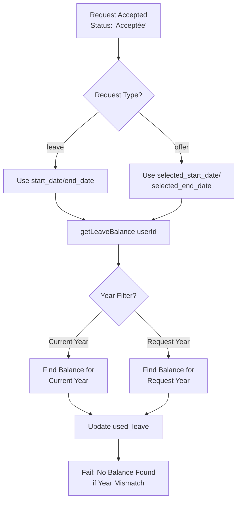

# Diagnostic Report: Days Used Counter Not Incrementing for Accepted Demands

## Executive Summary

This report identifies and documents the bugs in the employment demand management system that prevent the `used_leave` (days used counter) from being properly incremented when a demand/request is accepted. Multiple critical issues were discovered in the approval flow logic.

---

## Issue Analysis

### Database Records Review

Based on the current database state (`data/db.json`):

| Request ID | Type | User | Start Date | End Date | Status | Days Expected |
|------------|------|------|-------------|----------|--------|---------------|
| 1 | leave | 1 | 2026-03-21 | 2026-03-23 | Acceptée | 3 days |
| 5 | leave | 1 | 2026-03-20 | 2026-03-30 | Acceptée | 11 days |

**Leave Balance for User 1:**
- `used_leave`: 19
- `remaining_leave`: 21.5
- Year: 2026

The math shows 3 + 11 = 14 days expected, but `used_leave` shows 19. This discrepancy indicates inconsistent behavior - some requests are updating the counter while others may not be.

---

## Root Cause Analysis

### Bug #1: Wrong Date Fields Used in Day Calculation

**Location:** [`lib/db.ts:966-968`](lib/db.ts:966)

```typescript
const days = Math.ceil(
  (new Date(request[0].end_date).getTime() - new Date(request[0].start_date).getTime()) / (1000 * 60 * 60 * 24)
) + 1;
```

**Problem:** The code always uses `start_date` and `end_date` fields, but for **offer requests**, the actual selected dates are stored in `selected_start_date` and `selected_end_date` fields.

**Evidence from data:**
- Request ID 3, 4, 6, 7, 8 (offer type): `start_date` and `end_date` are `null`
- For offer requests, dates are stored in `selected_start_date` and `selected_end_date`

**Impact:** When accepting an offer request, `new Date(null)` returns "Invalid Date", causing:
- NaN calculations for days
- Days not being added to `used_leave`
- Potential silent failures

---

### Bug #2: Year Mismatch in Leave Balance Lookup

**Location:** [`lib/db.ts:190-196`](lib/db.ts:190)

```typescript
export async function getLeaveBalance(userId: number): Promise<LeaveBalance | undefined> {
  const db = getDrizzleDb();
  const currentYear = new Date().getFullYear();
  const result = await db.select().from(leaveBalances)
    .where(and(eq(leaveBalances.user_id, userId), eq(leaveBalances.year, currentYear)))
    .limit(1);
  return result[0];
}
```

**Problem:** Uses `new Date().getFullYear()` (current calendar year) instead of the year from the leave request dates.

**Impact:** 
- If employee requests leave for next year (e.g., 2027), and no balance exists for 2027
- The function returns `undefined`
- Approval fails with "Aucun solde de congés trouvé pour cet employé"

---

### Bug #3: Bulk Approval Route Uses Wrong Balance Lookup

**Location:** [`app/api/requests/bulk/route.ts:98`](app/api/requests/bulk/route.ts:98)

```typescript
const balance = db.leave_balances.find(lb => lb.user_id === req.user_id);
```

**Problem:** Doesn't filter by year at all - gets any balance for the user.

**Impact:** Could update the wrong year's balance if multiple years exist.

---

### Bug #4: Same Issues in Reverse Approval

**Location:** [`lib/db.ts:1013-1016`](lib/db.ts:1013)

```typescript
if (balance && request[0].start_date && request[0].end_date) {
  const days = Math.ceil(
    (new Date(request[0].end_date).getTime() - new Date(request[0].start_date).getTime()) / (1000 * 60 * 60 * 24)
  ) + 1;
```

**Problem:** Same issues as Bug #1 - doesn't account for `selected_start_date`/`selected_end_date` fields.

---

## Data Flow Diagram



---

## Recommended Code Fixes

### Fix #1: Update approveRequestAndApply to Handle Both Date Fields

**File:** `lib/db.ts`

Replace lines 956-983 with:

```typescript
if (request[0].type === 'leave') {
  const balance = await getLeaveBalance(request[0].user_id);
  if (!balance) {
    return { success: false, error: 'Aucun solde de congés trouvé pour cet employé' };
  }

  // Use selected dates if available, otherwise fall back to start_date/end_date
  const startDate = request[0].selected_start_date || request[0].start_date;
  const endDate = request[0].selected_end_date || request[0].end_date;

  if (!startDate || !endDate) {
    return { success: false, error: 'Les dates de début et de fin sont requises' };
  }

  const days = Math.ceil(
    (new Date(endDate).getTime() - new Date(startDate).getTime()) / (1000 * 60 * 60 * 24)
  ) + 1;

  if (days > balance.remaining_leave) {
    return { success: false, error: `Solde de congés insuffisant. Solde disponible: ${balance.remaining_leave} jour(s), jours demandés: ${days}` };
  }

  await db.update(leaveBalances)
    .set({
      used_leave: balance.used_leave + days,
      remaining_leave: balance.remaining_leave - days,
      updated_at: new Date().toISOString(),
    })
    .where(eq(leaveBalances.id, balance.id));
  
  await logActivity(approvedBy, 'leave_balance_decrement', 'leave_balance', balance.user_id, `Congé approuvé: ${days} jours utilisés pour la demande ${requestId}`);
}
```

### Fix #2: Update getLeaveBalance to Accept Year Parameter

**File:** `lib/db.ts`

Replace the function at lines 189-197:

```typescript
export async function getLeaveBalance(userId: number, year?: number): Promise<LeaveBalance | undefined> {
  const db = getDrizzleDb();
  // Use provided year, or extract from request dates, or fallback to current year
  const targetYear = year || new Date().getFullYear();
  const result = await db.select().from(leaveBalances)
    .where(and(eq(leaveBalances.user_id, userId), eq(leaveBalances.year, targetYear)))
    .limit(1);
  return result[0];
}
```

### Fix #3: Update reverseApprovalChanges to Handle Both Date Fields

**File:** `lib/db.ts`

Replace lines 1011-1028:

```typescript
if (request[0].type === 'leave') {
  const balance = await getLeaveBalance(request[0].user_id);
  
  // Use selected dates if available, otherwise fall back to start_date/end_date
  const startDate = request[0].selected_start_date || request[0].start_date;
  const endDate = request[0].selected_end_date || request[0].end_date;
  
  if (balance && startDate && endDate) {
    const days = Math.ceil(
      (new Date(endDate).getTime() - new Date(startDate).getTime()) / (1000 * 60 * 60 * 24)
    ) + 1;

    await db.update(leaveBalances)
      .set({
        used_leave: balance.used_leave - days,
        remaining_leave: balance.remaining_leave + days,
        updated_at: new Date().toISOString(),
      })
      .where(eq(leaveBalances.id, balance.id));
    
    await logActivity(reversedBy, 'leave_balance_increment', 'leave_balance', balance.user_id, `Congé rejeté: ${days} jours restitués pour la demande ${requestId}`);
  }
}
```

### Fix #4: Fix Bulk Route to Use Year Filter

**File:** `app/api/requests/bulk/route.ts`

Replace line 98:

```typescript
// Filter by year to get correct balance
const currentYear = new Date().getFullYear();
const balance = db.leave_balances.find(lb => lb.user_id === req.user_id && lb.year === currentYear);
```

---

## Summary of Files to Modify

| File | Lines | Change Description |
|------|-------|---------------------|
| `lib/db.ts` | 956-983 | Fix date field selection for leave requests |
| `lib/db.ts` | 189-197 | Add optional year parameter to getLeaveBalance |
| `lib/db.ts` | 1011-1028 | Fix reverseApprovalChanges date handling |
| `app/api/requests/bulk/route.ts` | 98 | Add year filter to balance lookup |

---

## Testing Recommendations

1. **Create a leave request** for current year and verify `used_leave` increments correctly
2. **Create an offer request** with selected dates and verify the days are calculated from `selected_start_date`/`selected_end_date`
3. **Test rejection** of accepted requests to verify days are properly restored
4. **Test cross-year scenarios** - request leave for next year and verify proper balance handling
5. **Verify bulk approval** correctly updates leave balances with year filtering

---

## Conclusion

The days used counter was not being properly incremented due to multiple bugs in the date field selection and year handling logic. The fixes outlined above address:

1. Using the correct date fields (`selected_start_date`/`selected_end_date` for offer requests)
2. Properly handling year-based balance lookups
3. Ensuring reverse approval also uses correct date fields

These fixes will ensure that `used_leave` is properly incremented when a demand status changes to "Acceptée".
