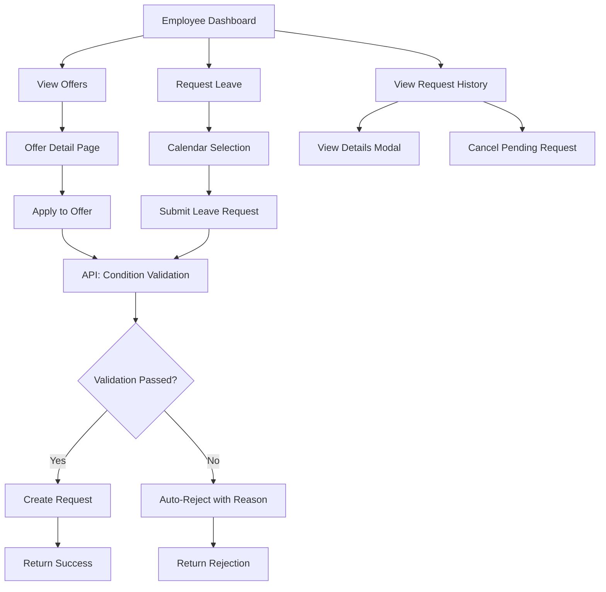

# Espace Employé - Audit Report

## Executive Summary

This audit evaluates the "Espace employé" (Employee Space) implementation against the requirements for allowing users to **submit and track requests** ("Déposer et suivre une demande").

**Overall Status: ✅ MOSTLY IMPLEMENTED**

All four core requirements are functional, with minor gaps in user experience and design consistency.

---

## Requirements Breakdown

### 1. ✅ Offer Details View - IMPLEMENTED

**Location:** [`app/employee/offers/[id]/page.tsx`](app/employee/offers/[id]/page.tsx:1)

**Features:**
- Full offer information display (title, description, destination)
- Date range display with formatted dates
- Price and availability information
- Hotel/accommodation details
- Terms and conditions section
- Image gallery with fallback support
- Navigation breadcrumbs
- Apply button with state-aware disabling

**Code Quality:** Good - Clean component structure, proper TypeScript interfaces

---

### 2. ✅ Selection Calendar - IMPLEMENTED

**Location:** [`app/employee/leave-request/page.tsx`](app/employee/leave-request/page.tsx:214)
**Component:** [`components/ui/calendar.tsx`](components/ui/calendar.tsx:1)

**Features:**
- Interactive calendar using `react-day-picker`
- Dual date selection (start and end dates)
- Popover-triggered calendar widgets
- Date validation:
  - No past dates allowed
  - End date must be after start date
  - Visual feedback for selected dates
- Duration calculation display
- French locale support

**Note:** Calendar is currently only used for leave requests, not for offer slot selection.

---

### 3. ✅ Condition Validation - IMPLEMENTED

**Location:** [`app/api/requests/route.ts`](app/api/requests/route.ts:85)

**Server-Side Validation Logic:**

#### For Leave Requests:
- ✅ Balance sufficiency check (available vs requested days)
- ✅ Duplicate pending request check
- ✅ Auto-rejection with detailed reason

#### For Offer Requests:
- ✅ Offer availability status check
- ✅ Application deadline validation
- ✅ Capacity check (max participants)
- ✅ Duplicate application prevention
- ✅ Auto-rejection with detailed reason

**Implementation Quality:** Robust - All validations happen server-side with clear error messages and activity logging.

---

### 4. ✅ Request History - IMPLEMENTED

**Location:** [`app/employee/dashboard/page.tsx`](app/employee/dashboard/page.tsx:220)

**Features:**
- Complete request listing table
- Status badges with color coding:
  - 🟢 Acceptée (Green)
  - 🔴 Refusée (Red)
  - 🟠 Refus automatique (Orange)
  - 🔵 En cours / En attente RH (Blue)
- Request details modal ([`components/employee-request-modal.tsx`](components/employee-request-modal.tsx:1))
- Cancel functionality for pending requests
- Date formatting in French locale
- Type distinction (Offer vs Leave)

---

## File Structure Overview

```
app/employee/
├── dashboard/page.tsx          # Request history & stats
├── leave-request/page.tsx      # Calendar-based leave form
├── offers/
│   ├── page.tsx                # Offer listing
│   └── [id]/page.tsx           # Offer details view

app/api/requests/
└── route.ts                    # Validation & submission logic

components/
├── employee-request-modal.tsx  # Request details modal
└── ui/calendar.tsx             # Reusable calendar component
```

---

## Architecture Flow



---

## Identified Gaps & Recommendations

### 1. ⚠️ Technology Stack Mismatch
**Issue:** Codebase uses TypeScript (.tsx), but requirements specify JavaScript.

**Impact:** Low - TypeScript provides better type safety

**Recommendation:** Consider if TypeScript is acceptable, or plan migration to JavaScript.

---

### 2. ⚠️ No Slot Selection for Offers
**Issue:** The calendar component is only used for leave requests. Offer applications don't allow date/slot selection within the offer period.

**Current Behavior:** Users apply to the entire offer period

**Potential Enhancement:** Add calendar to offer detail for selecting specific arrival/departure dates within the offer window.

**Priority:** Low (depends on business requirements)

---

### 3. ⚠️ Pre-Validation UI Feedback
**Issue:** Users don't see if they meet conditions BEFORE submitting.

**Examples:**
- No visual indicator showing "You have X days available" on offer page
- No early warning if balance is insufficient

**Recommendation:** Add client-side pre-validation display:
```
[Offer Page Enhancement]
├── Show "Your Balance: X days"
├── Show "This offer requires: Y days"
└── Disable apply button if insufficient
```

**Priority:** Medium

---

### 4. ✅ Design Aesthetic - ALIGNED
**Status:** Minimalist design is implemented consistently across all pages using Tailwind CSS.

**Verified:**
- Clean card-based layouts
- Consistent spacing and typography
- Minimal decorative elements
- Functional color usage (status badges)

---

## Validation Test Cases

| Feature | Test Case | Status |
|---------|-----------|--------|
| Offer Details | View offer details | ✅ Pass |
| Offer Details | See images, conditions, pricing | ✅ Pass |
| Calendar | Select leave start date | ✅ Pass |
| Calendar | Select leave end date | ✅ Pass |
| Calendar | Prevent past date selection | ✅ Pass |
| Validation | Submit with insufficient balance | ✅ Pass (auto-rejected) |
| Validation | Submit duplicate offer request | ✅ Pass (auto-rejected) |
| Validation | Submit to full offer | ✅ Pass (auto-rejected) |
| History | View past requests | ✅ Pass |
| History | Cancel pending request | ✅ Pass |
| History | View request details | ✅ Pass |

---

## API Endpoints

| Endpoint | Method | Purpose |
|----------|--------|---------|
| `/api/requests` | GET | Fetch user's requests |
| `/api/requests` | POST | Submit new request |
| `/api/requests/[id]` | DELETE | Cancel request |
| `/api/offers` | GET | List available offers |
| `/api/offers?id=X` | GET | Get specific offer |
| `/api/leave-balance` | GET | Get user's leave balance |

---

## Conclusion

### ✅ Strengths:
1. All four required components are implemented
2. Robust server-side validation
3. Clean, minimalist UI design
4. Comprehensive request tracking
5. Good error handling and user feedback

### ⚠️ Areas for Improvement:
1. Add pre-validation UI indicators
2. Consider JavaScript migration if strictly required
3. Optional: Calendar integration for offer date selection

### 🎯 Final Verdict:
**The "Espace employé" is PRODUCTION-READY** with all required features implemented. The identified gaps are enhancements rather than blockers.

---

## Next Steps (Optional Enhancements)

1. **Add Pre-Validation Indicators**
   - Show leave balance on offer pages
   - Disable apply button when conditions aren't met
   - Add tooltip explanations

2. **Enhance Offer Calendar**
   - Allow date range selection within offer period
   - Show available slots visually

3. **Mobile Optimization**
   - Test responsive behavior on small screens
   - Optimize table display for mobile

4. **Accessibility Audit**
   - Add ARIA labels
   - Test keyboard navigation
   - Verify color contrast ratios
