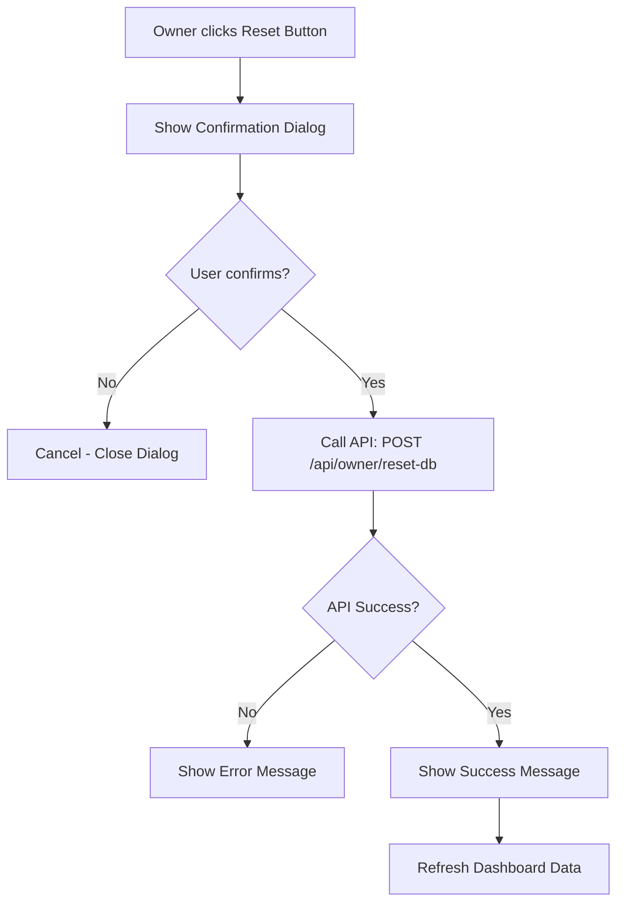

# Plan: Add "Reset Database" Button to Owner Dashboard

## Summary
Add a button in the owner dashboard that clears all database data except the 3 core accounts shown on the login page.

## Accounts to Keep
- `employee@example.com` (role: employee)
- `admin@example.com` (role: hr_admin)  
- `owner@example.com` (role: owner)

## Implementation Steps

### Step 1: Create API Endpoint
Create file: `app/api/owner/reset-db/route.ts`

**Functionality:**
- DELETE all data from these tables (in order to respect foreign keys):
  - `activity_logs`
  - `requests`
  - `leave_balances`
  - `offers`
  - `system_settings`
- DELETE all users EXCEPT the 3 nominated accounts by email
- Return success/failure response

### Step 2: Add Reset Button to Owner Dashboard
Modify: `app/owner/dashboard/page.tsx`

**Functionality:**
- Add a "Réinitialiser la base de données" (Reset Database) button
- Use AlertDialog component for confirmation dialog
- Show warning text explaining what will be deleted
- On confirm, call the API endpoint
- Show loading state during operation
- Show success/error toast notification

### Step 3: Implementation Details

**API Endpoint Response:**
```json
{
  "success": true,
  "message": "Database reset successfully. X users deleted, Y records removed."
}
```

**Button Placement:**
- Add in a "Danger Zone" card at the bottom of the dashboard
- Use destructive variant (red color) for the button

## Mermaid Flow Diagram



## Files to Modify/Create
1. **NEW**: `app/api/owner/reset-db/route.ts` - API endpoint
2. **MODIFY**: `app/owner/dashboard/page.tsx` - Add button and dialog
