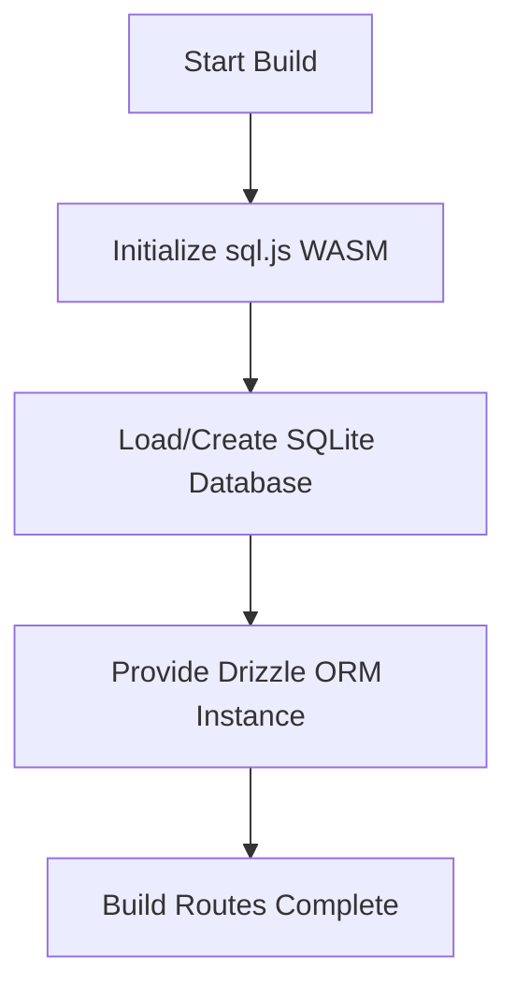

# Vercel Build Fix Implementation Plan

## Problem Analysis

The Vercel build is failing with two main errors:

### Error 1: better-sqlite3 Native Bindings
```
Error: Could not locate the bindings file. Tried:
→ /vercel/path0/node_modules/.pnpm/better-sqlite3@12.8.0/node_modules/better-sqlite3/build/better_sqlite3.node
...
```

**Root Cause**: better-sqlite3 is a native SQLite binding that requires C++ compilation. Vercel's build process is ignoring native build scripts (as shown in the warning: "Ignored build scripts: better-sqlite3@12.8.0").

### Error 2: Cookie Usage in Static Generation
```
[Security] Error in getCurrentUser: Error: Dynamic server usage: Route /offers couldn't be rendered statically because it used `cookies`
```

**Root Cause**: The `/offers` page (`app/offers/page.tsx`) calls `getCurrentUser()` which uses `cookies()`. This forces Next.js to render the page dynamically, but during the static generation phase, cookies aren't available.

## Solution: Switch to sql.js

sql.js is a pure JavaScript SQLite implementation compiled to WebAssembly. It runs entirely in the JavaScript runtime without native bindings, making it perfect for serverless environments like Vercel.

### Implementation Steps

### Step 1: Modify lib/db/index.ts
- Replace better-sqlite3 with sql.js
- Use Drizzle ORM with libsql driver
- Add async initialization for WASM loading
- Configure file-based storage using Vercel's temporary filesystem



### Step 2: Fix /offers Page Static Generation
- Add `export const dynamic = 'force-dynamic'` directive to the `/offers` page
- This explicitly tells Next.js to render dynamically, avoiding the static generation error

### Step 3: Update vercel.json (if needed)
- Ensure build command properly handles the new setup

## Database Migration Note

The existing SQLite database will need to be manually transferred or reinitialized since:
1. The new sql.js approach uses a different file path mechanism
2. Data persistence in serverless requires using Vercel's `/tmp` directory or object storage

## Alternative Solutions Considered

1. **Use Turso (libSQL)**: More production-ready but requires external service
2. **Configure pnpm to allow builds**: Complex and may not work on Vercel
3. **Use PostgreSQL via @vercel/postgres**: Requires database migration away from SQLite

## Expected Outcome

After implementing these changes:
- ✅ Build completes without native binding errors
- ✅ Database operations work in Vercel's serverless functions
- ✅ /offers page renders correctly (dynamically)