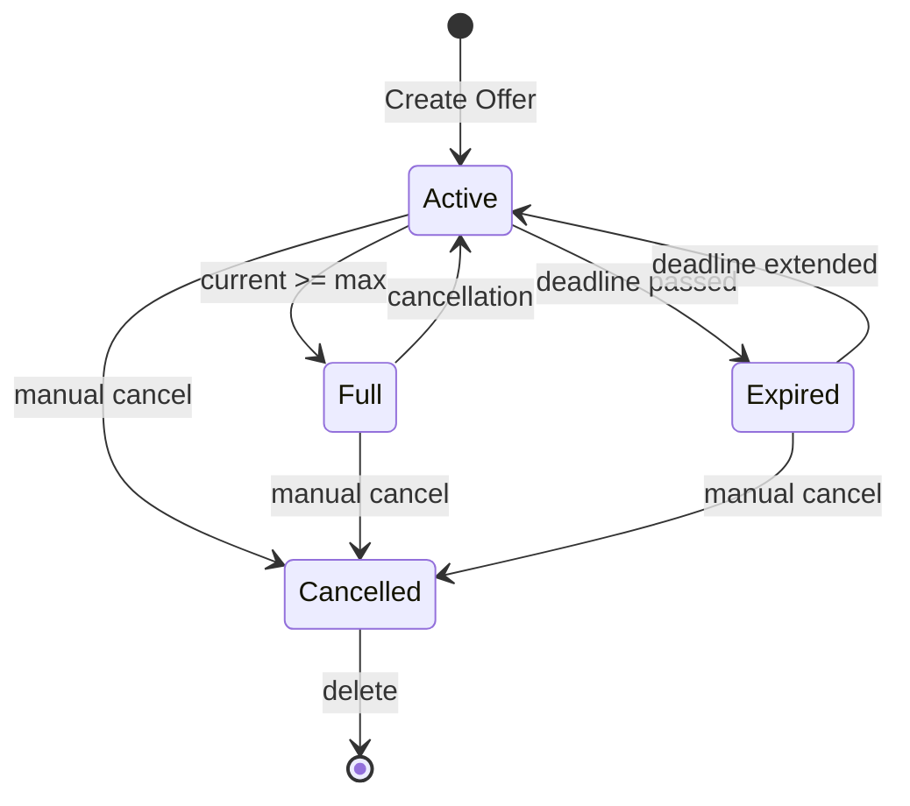
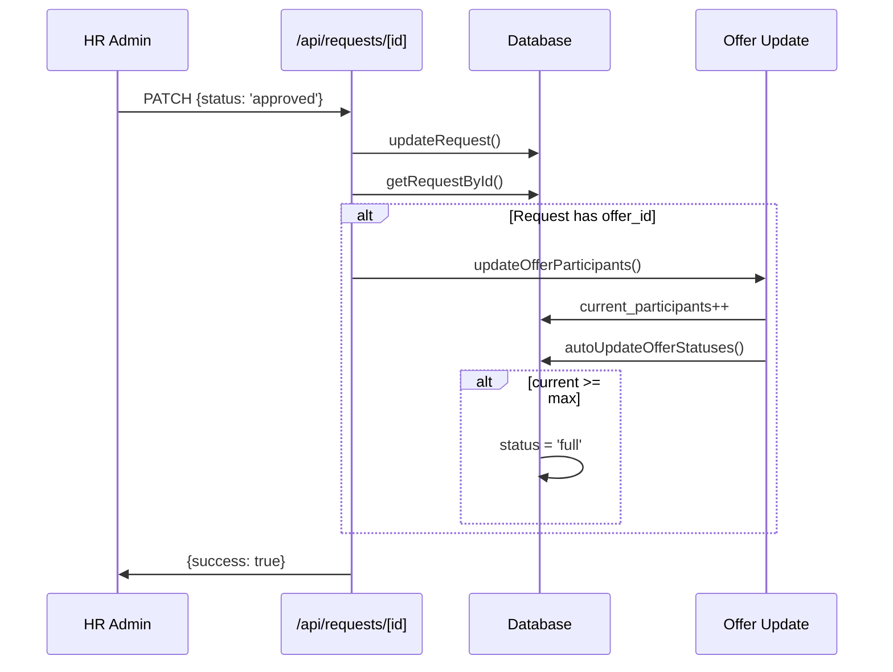

# Section 5.4 Audit: Offre de vacances (Holiday Offer) Entity

**Audit Date:** 2026-03-21  
**Auditor:** Architect Mode  
**Scope:** Database Schema, HR Forms, and Automated Business Logic

---

## Phase 1: Schema & UI Inventory

### Required Fields vs. Current Implementation

| # | Field (Spec) | Data Type | Current DB Field | Status | Location |
|---|--------------|-----------|------------------|--------|----------|
| 1 | **Titre** | String | `title` | ✅ EXISTS | [`lib/db.ts:67`](lib/db.ts:67) |
| 2 | **Destination** | String | `destination` | ✅ EXISTS | [`lib/db.ts:69`](lib/db.ts:69) |
| 3 | **Hébergement** | String | `hotel_name` | ✅ EXISTS | [`lib/db.ts:76`](lib/db.ts:76) |
| 4 | **Durée** | String/Int | ❌ **MISSING** | ❌ NOT FOUND | N/A |
| 5 | **Période** | Date Range | `start_date`, `end_date` | ✅ EXISTS | [`lib/db.ts:70-71`](lib/db.ts:70) |
| 6 | **Quota** | Integer | `max_participants` | ✅ EXISTS | [`lib/db.ts:73`](lib/db.ts:73) |
| 7 | **Places restantes** | Integer | `max_participants - current_participants` | ⚠️ DERIVED | Calculated field |
| 8 | **Description** | Text | `description` | ✅ EXISTS | [`lib/db.ts:68`](lib/db.ts:68) |
| 9 | **Date limite** | Date | `application_deadline` | ✅ EXISTS | [`lib/db.ts:75`](lib/db.ts:75) |
| 10 | **Statut** | Enum | `status` | ⚠️ MISMATCH | [`lib/db.ts:42`](lib/db.ts:42) |

### Field Details

#### 1. Titre ✅
- **Form Location:** [`app/admin/offers/page.tsx:529`](app/admin/offers/page.tsx:529)
- **API Handling:** [`app/api/offers/route.ts:61`](app/api/offers/route.ts:61)
- **Validation:** Required field

#### 2. Destination ✅
- **Form Location:** [`app/admin/offers/page.tsx:409`](app/admin/offers/page.tsx:409)
- **API Handling:** [`app/api/offers/route.ts:63`](app/api/offers/route.ts:63)
- **Validation:** Required field

#### 3. Hébergement ✅
- **Form Location:** [`app/admin/offers/page.tsx:474`](app/admin/offers/page.tsx:474)
- **API Handling:** [`app/api/offers/route.ts:69`](app/api/offers/route.ts:69)
- **DB Field:** `hotel_name`
- **Validation:** Optional field

#### 4. Durée ❌ MISSING
- **Spec Requirement:** Number of days and nights (e.g., "7 jours / 6 nuits")
- **Current State:** No field exists for duration
- **Impact:** Cannot store or display trip duration information
- **Required Action:** Add `duration` field to schema, forms, and API

#### 5. Période ✅
- **Form Location:** 
  - Start: [`app/admin/offers/page.tsx:420`](app/admin/offers/page.tsx:420)
  - End: [`app/admin/offers/page.tsx:428`](app/admin/offers/page.tsx:428)
- **DB Fields:** `start_date`, `end_date`
- **Validation:** Both required

#### 6. Quota ✅
- **Form Location:** [`app/admin/offers/page.tsx:451`](app/admin/offers/page.tsx:451)
- **DB Field:** `max_participants`
- **Validation:** Required, must be > 0

#### 7. Places restantes ⚠️ DERIVED
- **Current Implementation:** Calculated as `max_participants - current_participants`
- **DB Field:** `current_participants` tracks accepted participants
- **Display Locations:**
  - Admin dashboard: [`app/admin/dashboard/page.tsx:180`](app/admin/dashboard/page.tsx:180)
  - Admin offers list
- **Note:** Not stored as separate field, calculated on-the-fly

#### 8. Description ✅
- **Form Location:** [`app/admin/offers/page.tsx:400`](app/admin/offers/page.tsx:400)
- **DB Field:** `description`
- **Type:** Text (textarea)
- **Validation:** Optional

#### 9. Date limite ✅
- **Form Location:** [`app/admin/offers/page.tsx:465`](app/admin/offers/page.tsx:465)
- **DB Field:** `application_deadline`
- **Validation:** Optional date field

#### 10. Statut ⚠️ MISMATCH

**Current Enum Values (lib/db.ts:42):**
```typescript
export type OfferStatus = 'available' | 'full' | 'expired' | 'cancelled' | 'active' | 'inactive';
```

**Required per Section 5.4:**
- 'Disponible'
- 'Complet'
- 'En cours'
- 'Expiré / indisponible'

**Gap Analysis:**
| Required Value | Current Equivalent | Match |
|----------------|-------------------|-------|
| Disponible | available | ⚠️ English |
| Complet | full | ⚠️ English |
| En cours | active | ⚠️ Different semantics |
| Expiré / indisponible | expired | ⚠️ Partial match |

---

## Phase 2: Automated Business Logic Audit

### 2.1 Auto-Completion (Status → 'Complet' when full)

**Status:** ✅ IMPLEMENTED

**Implementation Details:**
- **Function:** [`autoUpdateOfferStatuses()`](lib/db.ts:324)
- **Logic:** Checks `current_participants >= max_participants`
- **Trigger:** Called on GET `/api/offers` for admin/HR users
- **Location:** [`app/api/offers/route.ts:21`](app/api/offers/route.ts:21)

```typescript
// lib/db.ts:345-348
if (offer.status === 'active' && offer.current_participants >= offer.max_participants && offer.max_participants > 0) {
  needsUpdate = true;
  offer.status = 'full';
}
```

**Per-Offer Function:** [`updateOfferStatusBasedOnParticipants()`](lib/db.ts:375)

---

### 2.2 Auto-Expiration (Status → 'Expiré' after deadline)

**Status:** ⚠️ PARTIALLY IMPLEMENTED / DISABLED

**Current Implementation:**
```typescript
// lib/db.ts:334-341
if (offer.application_deadline && offer.status === 'active') {
  const deadlineDate = new Date(offer.application_deadline);
  if (deadlineDate < now) {
    // Deadline passed - mark as expired
    // Note: In real business logic, you might want to keep it active until the trip date
    // For now, we just log this check but don't auto-expire
    console.log(`[AutoUpdate] Offer ${offer.id} deadline passed on ${offer.application_deadline}`);
  }
}
```

**Issue:** The code checks the deadline but explicitly does NOT auto-expire (see comment on line 339: "For now, we just log this check but don't auto-expire")

**Gap:** No automatic status change to 'expired' when deadline passes.

---

### 2.3 Decrement Logic (Places restantes on approval)

**Status:** ✅ IMPLEMENTED

**Implementation Details:**
- **Function:** [`updateOfferParticipants()`](lib/db.ts:755)
- **Trigger:** Called when request status changes to 'approved'
- **Location:** [`app/api/requests/[id]/route.ts:113`](app/api/requests/[id]/route.ts:113)

```typescript
// lib/db.ts:755-765
export async function updateOfferParticipants(offerId: number): Promise<boolean> {
  const db = await getDatabase();
  const offer = db.offers.find(o => o.id === offerId);
  
  if (!offer) return false;
  
  offer.current_participants += 1;  // Increment accepted count
  
  saveDatabase();
  return true;
}
```

**Request Approval Flow:**
```typescript
// app/api/requests/[id]/route.ts:107-122
if (status === 'approved') {
  // Re-fetch the request after potential date updates
  const updatedReq = await getRequestById(requestId);
  
  if (updatedReq?.offer_id) {
    await updateOfferParticipants(updatedReq.offer_id);  // Decrement available spots
  }
  // ... leave balance update
}
```

**Note:** This increments `current_participants`, which effectively decrements the remaining spots calculation (`max_participants - current_participants`).

---

## Phase 3: Gap Analysis Summary

### Critical Gaps

| Priority | Gap | Impact | Effort |
|----------|-----|--------|--------|
| 🔴 HIGH | Missing `duration` field | Cannot store/display trip duration | Medium |
| 🟡 MEDIUM | Auto-expiration disabled | Offers don't auto-expire after deadline | Low |
| 🟡 MEDIUM | Status enum in English | Doesn't match French specification | Medium |
| 🟢 LOW | No `places_restantes` stored | Calculated field works fine | Low |

### Required Changes

#### 1. Add Duration Field

**Files to modify:**
- [`lib/db.ts`](lib/db.ts:65) - Add `duration` to Offer interface
- [`app/admin/offers/page.tsx`](app/admin/offers/page.tsx:78) - Add to form state
- [`app/admin/offers/page.tsx`](app/admin/offers/page.tsx:400) - Add form input
- [`app/api/offers/route.ts`](app/api/offers/route.ts:61) - Add to POST handler
- [`app/api/offers/route.ts`](app/api/offers/route.ts:134) - Add to PUT handler
- [`data/db.json`](data/db.json) - Update existing offers

#### 2. Enable Auto-Expiration

**Files to modify:**
- [`lib/db.ts`](lib/db.ts:339) - Uncomment/enable auto-expiration logic

#### 3. Align Status Enum with French Specification

**Decision needed:** Should we:
- Option A: Change enum values to French (breaking change)
- Option B: Map English values to French labels in UI only (recommended)

**Recommended approach (Option B):**
- Keep English enum values in database
- Add display mapping function in UI components
- Update badge labels in admin and employee views

**Files to modify:**
- [`app/admin/offers/page.tsx`](app/admin/offers/page.tsx:615) - Update status badge labels
- [`app/admin/dashboard/page.tsx`](app/admin/dashboard/page.tsx:174) - Update status counts
- [`app/employee/offers/page.tsx`](app/employee/offers/page.tsx:1) - Update offer status display
- [`app/offers/page.tsx`](app/offers/page.tsx:1) - Update public offer display

---

## Implementation Task List

### Database & Schema
- [ ] Add `duration: string | null` field to Offer interface in [`lib/db.ts`](lib/db.ts:65)
- [ ] Add `duration` parameter to [`createOffer()`](lib/db.ts:458) function
- [ ] Add `duration` to [`updateOffer()`](lib/db.ts:501) function
- [ ] Update existing offers in [`data/db.json`](data/db.json) with duration values

### API Layer
- [ ] Update POST `/api/offers` to accept `duration` parameter
- [ ] Update PUT `/api/offers` to accept `duration` parameter

### HR Admin Forms
- [ ] Add `duration` to form state in [`app/admin/offers/page.tsx`](app/admin/offers/page.tsx:78)
- [ ] Add duration input field to create offer dialog
- [ ] Add duration input field to edit offer dialog

### Automated Logic
- [ ] Enable auto-expiration in [`autoUpdateOfferStatuses()`](lib/db.ts:339)
- [ ] Verify auto-completion logic is working correctly
- [ ] Test decrement logic on request approval

### UI Labels (Status Mapping)
- [ ] Create status label mapping utility function
- [ ] Update admin offers page status badges
- [ ] Update admin dashboard status counts
- [ ] Update employee offers page status display
- [ ] Update public offers page status display

### Testing
- [ ] Test offer creation with duration
- [ ] Test offer edit with duration
- [ ] Test auto-expiration when deadline passes
- [ ] Test auto-completion when quota reached
- [ ] Test spots decrement on approval

---

## Mermaid Diagram: Offer Status Workflow



## Mermaid Diagram: Request Approval Flow



---

## Conclusion

The "Offre de vacances" entity is **mostly compliant** with Section 5.4 specifications. The critical gap is the missing `duration` field which is explicitly required. The automated business logic is implemented but auto-expiration is currently disabled. Status values exist but are in English rather than French as specified.

**Recommendation:** Proceed with Phase 4 implementation to address all identified gaps.
