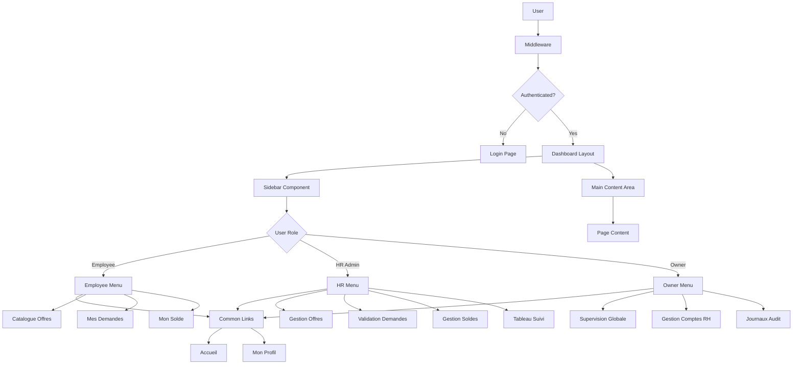

# Sidebar Navigation Implementation Plan

## Overview
Refactor the application from a top Navbar to a modern Dashboard Sidebar navigation with Role-Based Access Control (RBAC).

---

## Architecture Diagram



---

## Route Structure

### New Dashboard Routes (to create)

| Route | Role Access | Description | Maps To |
|-------|-------------|-------------|---------|
| `/dashboard` | All | Dashboard home | Role-based redirect |
| `/dashboard/offres` | Employee, HR | Offer catalog | Employee view or HR CRUD |
| `/dashboard/demandes` | Employee | My requests/history | `/employee/dashboard` |
| `/dashboard/validation` | HR | Pending inbox | `/admin/requests` |
| `/dashboard/utilisateurs` | HR, Owner | Employee balances | `/admin/balances` |
| `/dashboard/logs` | Owner | Audit logs | `/owner/activity-logs` |
| `/dashboard/profil` | All | User profile | New page |
| `/dashboard/admins` | Owner | RH Admin mgmt | `/owner/admins` |

### Existing Routes (to maintain/redirect)

| Current Route | Action | Target |
|---------------|--------|--------|
| `/employee/dashboard` | Keep/Redirect | `/dashboard/demandes` |
| `/employee/offers` | Keep/Redirect | `/dashboard/offres` |
| `/employee/leave-request` | Keep | Accessible from demandes |
| `/admin/dashboard` | Keep/Redirect | `/dashboard` |
| `/admin/offers` | Keep/Redirect | `/dashboard/offres` |
| `/admin/requests` | Keep/Redirect | `/dashboard/validation` |
| `/admin/balances` | Keep/Redirect | `/dashboard/utilisateurs` |
| `/owner/dashboard` | Keep/Redirect | `/dashboard` |
| `/owner/admins` | Keep/Redirect | `/dashboard/admins` |
| `/owner/activity-logs` | Keep/Redirect | `/dashboard/logs` |
| `/owner/settings` | Keep | Accessible from profil |

---

## Navigation Configuration

### Common Links (All Roles)
```typescript
{
  title: 'Accueil',
  href: '/dashboard',
  icon: Home
},
{
  title: 'Mon Profil',
  href: '/dashboard/profil',
  icon: User
}
```

### Employee Links (Role: employee)
```typescript
{
  title: 'Catalogue des Offres',
  href: '/dashboard/offres',
  icon: Briefcase
},
{
  title: 'Mes Demandes',
  href: '/dashboard/demandes',
  icon: ClipboardList
},
{
  title: 'Mon Solde',
  href: '/dashboard/solde',
  icon: Wallet
}
```

### HR Links (Role: hr_admin)
```typescript
{
  title: 'Gestion des Offres',
  href: '/dashboard/offres',
  icon: Briefcase
},
{
  title: 'Validation des Demandes',
  href: '/dashboard/validation',
  icon: Inbox,
  badge: 'pendingCount'
},
{
  title: 'Gestion des Soldes',
  href: '/dashboard/utilisateurs',
  icon: Users
},
{
  title: 'Tableau de Suivi',
  href: '/dashboard',
  icon: LayoutDashboard
}
```

### Owner Links (Role: owner)
```typescript
{
  title: 'Supervision Globale',
  href: '/dashboard',
  icon: LayoutDashboard
},
{
  title: 'Gestion des Comptes RH',
  href: '/dashboard/admins',
  icon: Shield
},
{
  title: 'Journaux d\'Audit',
  href: '/dashboard/logs',
  icon: FileText
},
{
  title: 'Paramétrage',
  href: '/owner/settings',
  icon: Settings
}
```

---

## Component Structure

```
app/
├── dashboard/
│   ├── layout.tsx          # Dashboard shell with sidebar
│   ├── page.tsx            # Role-based dashboard home
│   ├── offres/
│   │   └── page.tsx        # Offer catalog (role-aware)
│   ├── demandes/
│   │   └── page.tsx        # Employee request history
│   ├── validation/
│   │   └── page.tsx        # HR validation inbox
│   ├── utilisateurs/
│   │   └── page.tsx        # User balances management
│   ├── logs/
│   │   └── page.tsx        # Audit logs (owner)
│   ├── admins/
│   │   └── page.tsx        # RH admin management
│   ├── profil/
│   │   └── page.tsx        # User profile
│   └── solde/
│       └── page.tsx        # Leave balance display
components/
├── dashboard-sidebar.tsx   # Main sidebar component
├── dashboard-layout.tsx    # Layout wrapper
├── dashboard-nav.tsx       # Navigation items
└── user-nav.tsx            # User dropdown in sidebar
```

---

## UI/UX Specifications

### Sidebar Design
- **Position**: Fixed left
- **Width**: 16rem (expanded), 3rem (collapsed icon-only)
- **Mobile**: Sheet overlay (18rem width)
- **Background**: Deep blue (`slate-900` or custom `#1e3a5f`)
- **Text**: Light gray/white
- **Active Item**: Lighter blue with border accent

### Branding Colors (Fenie Brossette)
```css
--fb-primary: #1e3a5f;      /* Deep blue */
--fb-secondary: #4a6fa5;    /* Medium blue */
--fb-accent: #6b9bd1;       /* Light blue */
--fb-bg: #f8fafc;           /* Light gray background */
--fb-text: #1e293b;         /* Dark text */
--fb-text-light: #f1f5f9;   /* Light text */
```

### Icons (Lucide-react)
- Home: `Home`
- Profile: `User`
- Offers: `Briefcase` or `Package`
- Requests: `ClipboardList`
- Validation: `Inbox` or `CheckCircle`
- Users: `Users`
- Balance: `Wallet`
- Logs: `FileText` or `ScrollText`
- Settings: `Settings`
- Logout: `LogOut`
- Menu Toggle: `Menu` / `X`

---

## Implementation Phases

### Phase 1: Layout Structure
1. Create `app/dashboard/layout.tsx` with SidebarProvider
2. Create `components/dashboard-sidebar.tsx` with role-based menu
3. Set up `components/dashboard-layout.tsx` wrapper

### Phase 2: Navigation
1. Define navigation configuration objects
2. Implement menu rendering based on role
3. Add active state detection using `usePathname()`
4. Create user footer with logout

### Phase 3: Pages
1. Create all `/dashboard/*` routes
2. Implement role-based content in each page
3. Reuse existing components from current pages

### Phase 4: Integration
1. Update root layout
2. Update middleware for new routes
3. Add redirects from old routes

### Phase 5: Styling
1. Apply brand colors
2. Add transitions and animations
3. Mobile responsiveness testing

---

## Mobile Responsiveness

### Desktop (>768px)
- Sidebar always visible
- Collapsible to icon-only mode
- Toggle button on sidebar rail

### Mobile (<=768px)
- Hamburger menu in header
- Sheet overlay for sidebar
- Full menu items with text
- Close on navigation

---

## Security Considerations

1. **Middleware Updates**: Add `/dashboard/*` to protected routes
2. **Role Guards**: Each page checks role access
3. **API Protection**: Existing API routes remain protected
4. **Redirect Logic**: Unauthorized access redirects to login

---

## Migration Strategy

1. Create new dashboard structure alongside existing
2. Test thoroughly in all roles
3. Update navigation to point to new routes
4. Add redirects from old routes
5. Deprecate old routes after confirmation

---

## Testing Checklist

- [ ] Sidebar renders for Employee role
- [ ] Sidebar renders for HR Admin role
- [ ] Sidebar renders for Owner role
- [ ] Common links visible to all
- [ ] Role-specific links only visible to appropriate roles
- [ ] Active state highlights current route
- [ ] Mobile hamburger opens/closes sidebar
- [ ] Logout button works from sidebar
- [ ] User name displays correctly
- [ ] All navigation links work
- [ ] Unauthorized access redirects to login
