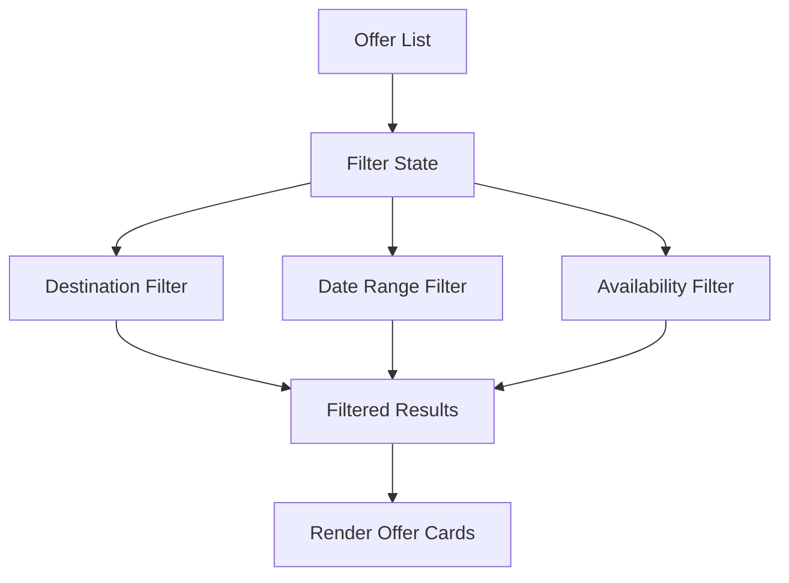
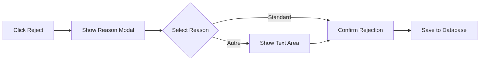

# UI Enhancements & HR Admin Features - Implementation Plan

## Executive Summary

This plan outlines the implementation of specific UI enhancements and HR administrative features to improve user experience and reporting efficiency in the vacation management system.

---

## Phase 1: Frontend & Filtering

### 1.1 Real-time Availability - 'Places restantes' Counter

**Current State:**
The employee offers page already calculates `spotsAvailable = offer.max_participants - offer.current_participants` but needs enhanced visual presentation.

**Implementation Details:**

```typescript
// Component: PlacesCounterBadge
interface PlacesCounterBadgeProps {
  maxParticipants: number;
  currentParticipants: number;
}

const getBadgeVariant = (spotsAvailable: number) => {
  if (spotsAvailable === 0) return 'destructive';      // Red - Complet
  if (spotsAvailable <= 3) return 'warning';           // Orange - Almost full
  return 'success';                                    // Green - Available
};
```

**Files to Modify:**
- `app/employee/offers/page.tsx` - Enhance existing badge display
- `app/dashboard/offres/page.tsx` - Add counter badge to admin view
- `app/offers/page.tsx` - Public offers page (if applicable)

**Database Verification:**
Ensure `current_participants` is atomically updated when requests are approved:
```typescript
// In lib/db.ts - approveRequestAndApply function
const newCurrent = offer.current_participants + 1;
const newStatus = newCurrent >= offer.max_participants ? 'Complet' : 'Disponible';
```

---

### 1.2 Advanced Discovery - Filter System

**Architecture:**



**Filter Component Structure:**

```typescript
// components/offer-filters.tsx
interface OfferFiltersProps {
  offers: Offer[];
  onFilterChange: (filtered: Offer[]) => void;
}

interface FilterState {
  destination: string | 'all';
  dateRange: { start: Date | null; end: Date | null };
  onlyAvailable: boolean;
}
```

**Client-Side Filtering Logic:**

```typescript
const applyFilters = (offers: Offer[], filters: FilterState): Offer[] => {
  return offers.filter(offer => {
    // Destination filter
    if (filters.destination !== 'all' && 
        offer.destination !== filters.destination) {
      return false;
    }
    
    // Date range filter
    if (filters.dateRange.start && 
        new Date(offer.start_date) < filters.dateRange.start) {
      return false;
    }
    if (filters.dateRange.end && 
        new Date(offer.end_date) > filters.dateRange.end) {
      return false;
    }
    
    // Availability filter
    if (filters.onlyAvailable && 
        offer.status !== 'Disponible') {
      return false;
    }
    
    return true;
  });
};
```

**Files to Create/Modify:**
- `components/offer-filters.tsx` - New reusable filter component
- `app/employee/offers/page.tsx` - Integrate filters
- `app/dashboard/offres/page.tsx` - Integrate filters for admin view

---

### 1.3 Employee History - 'Mes Demandes' Table

**Current State:**
`app/dashboard/demandes/page.tsx` exists but needs enhancement.

**Enhancements Needed:**

```typescript
// Additional columns and features
interface EnhancedRequest extends Request {
  // Already enriched: offer_title, destination, hotel_name
  type_label: string;           // 'Congé' | 'Offre'
  status_badge_color: string;
  can_cancel: boolean;          // Only pending requests
}

// Filter options
interface RequestFilters {
  status: 'all' | 'pending' | 'approved' | 'rejected';
  type: 'all' | 'leave' | 'offer';
  sortBy: 'date_desc' | 'date_asc' | 'status';
}
```

**Table Columns:**
| Column | Description |
|--------|-------------|
| Type | Icon + Label (Congé/Offre) |
| Dates | Start - End or N/A for offers |
| Destination | Offer destination or "N/A" |
| Status | Badge with color coding |
| Date de demande | Creation timestamp |
| Actions | View details, Cancel (if pending) |

---

## Phase 2: HR Admin Features

### 2.1 Standardized Refusal Reasons

**Standardized Reasons List:**

```typescript
const REFUSAL_REASONS = [
  { value: 'insufficient_balance', label: 'Solde de congés insuffisant' },
  { value: 'spots_full', label: 'Places épuisées pour cette offre' },
  { value: 'dates_unavailable', label: 'Dates non disponibles' },
  { value: 'deadline_passed', label: 'Date limite de candidature dépassée' },
  { value: 'eligibility', label: "Non éligible à l'offre" },
  { value: 'other', label: 'Autre (préciser)' },
] as const;
```

**UI Flow:**



**Database Schema (No Changes Needed):**
The existing `approval_reason` field in the Request interface will store the standardized reason.

**Files to Modify:**
- `components/request-details-modal.tsx` - Add standardized reason dropdown
- `components/request-reject-modal.tsx` - Enhanced rejection modal (if separate)
- `app/dashboard/validation/page.tsx` - Pass reason through API call

---

### 2.2 HR Analytics Dashboard

**Statistic Card Design:**

```typescript
// PendingRequestsCard component
interface PendingRequestsCardProps {
  count: number;
  onClick: () => void;
}

// Visual hierarchy:
// - Large number display
// - Alert styling when count > 0 (yellow/orange background)
// - "Voir les demandes" action button
// - Icon: Inbox or Clock
```

**Integration Points:**

```typescript
// In app/dashboard/page.tsx
const pendingCount = stats.pendingRequests || 0;

<PendingRequestsCard 
  count={pendingCount}
  alert={pendingCount > 5}  // Highlight if backlog
  onClick={() => router.push('/dashboard/validation')}
/>
```

**Sidebar Badge (Optional Enhancement):**
Add a badge to the "Validation" sidebar item showing pending count.

---

## Phase 3: Verification Requirements

### Places Restantes Calculation

**Formula:**
```
Places restantes = max_participants - current_participants
```

**Verification Steps:**
1. Check that `current_participants` increments when a request is approved
2. Verify the offer status changes to 'Complet' when `current_participants >= max_participants`
3. Ensure counter updates reflect in real-time after approval actions

### Filter Performance

**Requirements:**
- Filters must work client-side (no page reload)
- State persistence during navigation (optional: URL query params)
- Smooth animations when filtering (Framer Motion or CSS transitions)

---

## File Structure

```
app/
├── employee/
│   └── offers/
│       └── page.tsx          # Enhanced with filters
├── dashboard/
│   ├── page.tsx              # Add pending requests stat card
│   ├── offres/
│   │   └── page.tsx          # Add places counter badge
│   ├── demandes/
│   │   └── page.tsx          # Enhanced history table
│   └── validation/
│       └── page.tsx          # Integrate standardized reasons
├── api/
│   └── requests/
│       └── [id]/
│           └── route.ts      # Verify reason handling
components/
├── offer-filters.tsx         # NEW: Reusable filter component
├── offer-card.tsx            # NEW: Enhanced offer card with counter
├── places-badge.tsx          # NEW: Places counter badge component
├── pending-requests-card.tsx # NEW: HR stat card
└── request-details-modal.tsx # MODIFY: Add standardized reasons
```

---

## Implementation Sequence

1. **Start with Phase 1.1** - Places counter (quick win, builds foundation)
2. **Phase 1.2** - Filter system (requires more UI work)
3. **Phase 1.3** - Employee history enhancements
4. **Phase 2.1** - Standardized refusal reasons
5. **Phase 2.2** - HR analytics card
6. **Phase 3** - Verification and testing

---

## Database Query for Pending Requests

For reference, here's the query logic for the HR dashboard:

```typescript
// In app/api/dashboard/stats/route.ts
const pendingRequests = requests.filter(
  r => r.status === 'En cours / En attente RH'
).length;

// This count should be returned in the stats API response
```

The database already tracks this via the `status` field on requests.

---

## Notes

- All changes should maintain TypeScript type safety
- Use existing UI components from `components/ui/` for consistency
- Follow the established pattern of client-side state management with React hooks
- Ensure responsive design for mobile views
- Maintain accessibility standards (ARIA labels, keyboard navigation)
